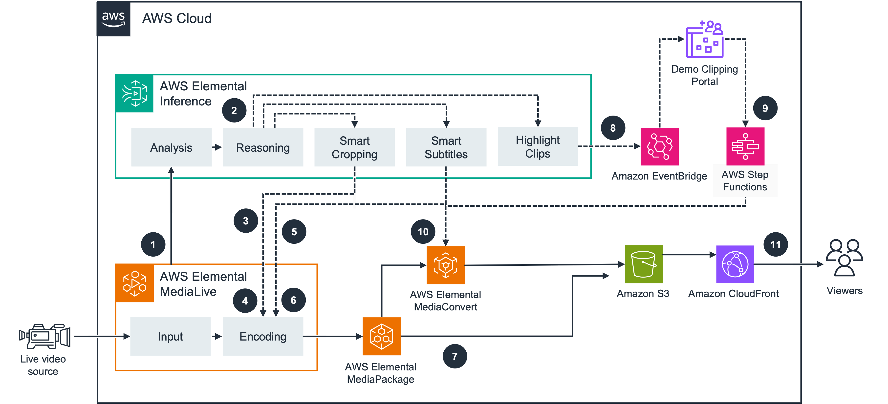

# Sample Elemental Inference Video Clipping Portal

**Version:** 1.0.0

> **Note:** This project is a sample application designed to accelerate evaluation of [AWS Elemental Inference](https://aws.amazon.com/elemental-inference/). It provides a ready-made environment for testing how Elemental Inference integrates into a video workflow and how it performs against your own content. It is not intended for production use.

A video clipping portal for live sports content, powered by AWS Elemental Inference, in conjunction with other AWS Media Services for AI-driven smart-cropping and highlight detection.

Operators can manage live video channels, automatically detect highlights from live streams, harvest and edit clips in both landscape and portrait orientations, and export finished MP4s for distribution.


## How It Works



1. [AWS Elemental MediaLive](https://aws.amazon.com/medialive/) sends the incoming video stream to an associated [AWS Elemental Inference](https://aws.amazon.com/elemental-inference/) feed.
2. Elemental Inference analyses the video for both smart cropping and event clipping, and the audio for smart subtitles.
3. The smart cropping feature determines key areas of interest. Inference returns the desired cropping coordinates back to the MediaLive channel.
4. MediaLive uses these coordinates to encode a vertical (portrait) aspect ratio version of the input, and sends this output, along with the landscape encode at its defined resolutions, to [AWS Elemental MediaPackage](https://aws.amazon.com/mediapackage/).
5. The smart subtitles feature uses advanced speech recognition to transcribe the spoken audio, returning the transcription to MediaLive.
6. MediaLive uses this subtitle data to feed its caption stream, which it sends to MediaPackage as Timed Text Markup Language (TTML).
7. MediaPackage acts as the just-in-time packager (JITP) and serves as the origin for live content.
8. Inference detects key moments and sends timing details via [Amazon EventBridge](https://aws.amazon.com/eventbridge/).
9. The demo clipping portal displays these key moments and allows operators to choose and modify which ones to publish. Selected highlights are processed via an [AWS Step Functions](https://aws.amazon.com/step-functions/) state machine, which triggers MediaPackage harvest jobs.
10. Harvested content is processed by AWS Elemental MediaConvert to create frame-accurate MP4 and/or HLS VOD assets. These assets are stored in [Amazon S3](https://aws.amazon.com/s3/).
11. An [Amazon CloudFront](https://aws.amazon.com/cloudfront/) distribution is configured with the S3 bucket and MediaPackage channel as origins, serving a combination of live and VOD content to viewers.

## Architecture Notes

### Combined landscape and portrait output group

As a sample application, this portal makes one deliberate encoding choice that differs from what we would recommend for a production workflow.

The MediaLive channel groups both the landscape encode and the smart-cropped portrait encode into the **same** MediaPackage output group. This is intentional: keeping both orientations in a single manifest makes it straightforward for the portal to load them together and present a synchronized, side-by-side comparison of the two aspect ratios.

In a production implementation we generally recommend separating the landscape and portrait encodes into **different MediaLive output groups**, so that each orientation is delivered as its own logical stream. Combining them as this sample does means the renditions share a single manifest, so a standard adaptive-bitrate player may see them as interchangeable variants and could unintentionally switch between orientations during playback. Avoiding that behaviour would require additional downstream logic or manifest filtering to ensure each player only receives the orientation it is meant to play.

This trade-off is acceptable here because the goal is to evaluate AWS Elemental Inference and demonstrate the side-by-side experience, not to model a production delivery topology.

## Tech Stack

| Layer | Technology |
|-------|-----------|
| Frontend | React 18, TypeScript, Vite, Cloudscape Design System |
| Auth | Amazon Cognito via AWS Amplify |
| API | API Gateway v2 (HTTP) → Lambda (Python + TypeScript) |
| Orchestration | Step Functions (ASL JSON) |
| Video | MediaLive, MediaPackage V2, MediaConvert |
| AI | AWS Elemental Inference (smart-cropping and clipping) |
| Storage | S3 (video assets), DynamoDB (metadata) |
| CDN | CloudFront + WAFv2 |
| Infrastructure | AWS CDK v2 (TypeScript), cdk-nag compliance |

## Project Structure

```
.
├── api/                    # Lambda functions (Python + TypeScript)
│   └── src/
│       ├── channels-python/        # Channel CRUD
│       ├── clips/                  # Clip CRUD (TypeScript)
│       ├── events/                 # Event CRUD (TypeScript)
│       ├── harvest-pipeline-python/# EventBridge → harvest job creation
│       ├── harvest-task/           # Execute harvest job
│       ├── harvest-poll/           # Poll harvest status
│       ├── harvest-validate/       # Validate harvest output
│       ├── harvest-cleanup/        # Clean up old harvest jobs
│       ├── transcode-task/         # Submit MediaConvert job
│       ├── transcode-poll/         # Poll transcode status
│       ├── download-api/           # Download orchestration + presigned URLs
│       ├── video-processor/        # Video processing utilities
│       ├── medialive-api-client/   # MediaLive API wrapper
│       ├── medialive-status/       # Channel status checks
│       ├── create-feed-lambda/     # Inference feed creation
│       ├── auto-activate-scheduler/# Scheduled inference activation
│       ├── mediaconvert-completion-handler/ # MediaConvert callback
│       ├── jobs-api/               # Processing jobs management
│       ├── system-settings/        # System settings API
│       └── templates/              # Template management
├── deploy/                 # CDK infrastructure (TypeScript)
│   └── src/
│       ├── app-stack.ts            # Main application stack
│       ├── cf-waf-stack.ts         # WAF stack (us-east-1)
│       ├── constructs/             # Reusable CDK constructs
│       └── state-machines/         # Step Functions ASL definitions
├── web-app/                # React SPA
│   └── src/
│       ├── pages/                  # Home, Channels, ClipEditor, Settings, Docs
│       ├── components/             # UI components
│       ├── services/               # API + download + video services
│       ├── hooks/                  # useAuth, useClips, useEvents, useJobs
│       └── types/                  # TypeScript type definitions
└── scripts/                # Utility scripts (fetch-config.sh for local dev)
```

## Quick Start

```bash
# Prerequisites: Node.js >= 20.19, Python >= 3.8, Docker, AWS CLI

# Build everything
npm run build

# Bootstrap CDK (first time only)
npm run deploy.bootstrap

# Deploy
npm run deploy

# Create a Cognito user, then open the CloudFront URL from CDK outputs
```

See [DEPLOYMENT_GUIDE.md](./DEPLOYMENT_GUIDE.md) for detailed setup, deployment instructions, and configuration management.

See [USER_GUIDE.md](./USER_GUIDE.md) for the operator guide covering channel management, clip processing, video editing, and system settings.

See [DATA_FLOW_DIAGRAM.md](./DATA_FLOW_DIAGRAM.md) for detailed data flow diagrams covering ingestion, AI processing, harvesting, editing, and export paths.

## Common Commands

```bash
npm run build              # Build all components
npm run build.api          # Build Lambda functions only
npm run build.web          # Build React app only
npm run build.deploy       # Build CDK only
npm run deploy             # Deploy all stacks
npm run destroy            # Tear down all stacks
STACK_NAME="my-stack" npm run deploy  # Deploy with custom stack name
```

## Contributing

See [CONTRIBUTING.md](./CONTRIBUTING.md) for build and deployment conventions.

## License

See [LICENSE](./LICENSE).
